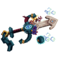
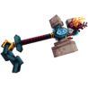
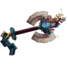
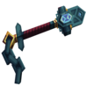
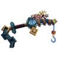
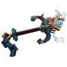

# ☀️ Outils de l'Été

## 🔹 <ins>Son obtention</ins>🤔

Les <mark style="color:cyan;">outils de l'Été</mark> s'obtiennent dans la [<mark style="color:cyan;">caisse Aquatique</mark>](https://wiki.evolucraft.fr/le-gameplay/les-caisses#caisse-aquatique), via l'Outils Aléatoire obtenable dans le [<mark style="color:yellow;">Lucky Block Gold</mark>](https://wiki.evolucraft.fr/le-gameplay/lucky-block#lucky-block-gold) ou encore à <mark style="color:green;">l'achat</mark> dans [<mark style="color:green;">l'hôtel de vente</mark>](https://wiki.evolucraft.fr/le-gameplay/le-commerce#hotel-des-ventes).

## 🔹 <ins>Son aperçu</ins>🔍

<table border="1" cellspacing="0" cellpadding="6">
  <tr>
    <td align="center"><strong><ins>Nom</ins> 🏷️</strong></td>
    <td align="center"><strong><ins>Enchantement</ins> 📖</strong></td>
    <td align="center"><strong><ins>Durabilité</ins> 📏</strong></td>
    <td align="center"><strong><ins>Effet</ins> ✨</strong></td>    
  </tr>
  <tr>
   <td align="center">
     
<mark style="color:cyan;"><strong>Épée de l'Été</strong></mark>

     
<figure></figure>

   </td>
   <td>
     
▸ <mark style="color:cyan;"><strong>Tranchant V</strong></mark>

     
▸ <mark style="color:cyan;"><strong>Châtiment VI</strong></mark>

     
▸ <mark style="color:cyan;"><strong>Fléau des Arthropodes VI</strong></mark>

     
▸ <mark style="color:cyan;"><strong>Affilage III</strong></mark>

     
▸ <mark style="color:cyan;"><strong>Butin X</strong></mark>

   </td>
   <td align="center">
     
<mark style="color:cyan;"><strong>4 500</strong></mark> de <mark style="color:cyan;"><strong>Durabilité</strong></mark>

   </td>
   <td>
     
<strong><mark style="color:cyan;">Aucun Effet</mark> Supplémentaire ❌</strong>

   </td>
  </tr>
  <tr>
   <td align="center">
     
<mark style="color:cyan;"><strong>Marteau de l'Été</strong></mark>

     
<figure></figure>

   </td>
   <td>
     
▸ <mark style="color:cyan;"><strong>Toucher de Soie</strong></mark>

     
▸ <mark style="color:cyan;"><strong>Efficacité VI</strong></mark>

   </td>
   <td align="center">
     
<mark style="color:cyan;"><strong>4 000</strong></mark> de <mark style="color:cyan;"><strong>Durabilité</strong></mark>

   </td>
   <td>
     
▸ <mark style="color:cyan;"><strong>Effet Hammer</strong></mark> : Casse les blocs dans une zone de 3x3.

   </td>
  </tr>
  <tr>
   <td align="center">
     
<mark style="color:cyan;"><strong>Hache de l'Été</strong></mark>

     
<figure></figure>

   </td>
   <td>
     
▸ <mark style="color:cyan;"><strong>Efficacité X</strong></mark>

   </td>
   <td align="center">
     
<mark style="color:cyan;"><strong>4 500</strong></mark> de <mark style="color:cyan;"><strong>Durabilité</strong></mark>

   </td>
   <td>
     
▸ <mark style="color:cyan;"><strong>Effet Bûcheron</strong></mark> : Abat jusqu'à 4 blocs d'un arbre d'un seul coup.

   </td>
  </tr>
  <tr>
   <td align="center">
     
<mark style="color:cyan;"><strong>Pelle de l'Été</strong></mark>

     
<figure></figure>

   </td>
   <td>
     
▸ <mark style="color:cyan;"><strong>Efficacité X</strong></mark>

   </td>
   <td align="center">
     
<mark style="color:cyan;"><strong>5 500</strong></mark> de <mark style="color:cyan;"><strong>Durabilité</strong></mark>

   </td>
   <td>
     
▸ <mark style="color:cyan;"><strong>Effet Magnet</strong></mark> : Ramasse les blocs cassées.

   </td>
  </tr>
  <tr>
   <td align="center">
     
<mark style="color:cyan;"><strong>Canne à Pêche de l'Été</strong></mark>

     
<figure></figure>

   </td>
   <td>
     
▸ <mark style="color:cyan;"><strong>Chance de la Mer V</strong></mark>

     
▸ <mark style="color:cyan;"><strong>Appât IV</strong></mark>

   </td>
   <td align="center">
     
<mark style="color:cyan;"><strong>1 250</strong></mark> de <mark style="color:cyan;"><strong>Durabilité</strong></mark>

   </td>
   <td>
     
▸ <mark style="color:cyan;"><strong>Effet Pêche</strong></mark> : Vous avez 100% de chance de doubler votre pêche.

   </td>
  </tr>
  <tr>
   <td align="center">
     
<mark style="color:cyan;"><strong>Bâton de l'Été</strong></mark>

     
<figure></figure>

   </td>
   <td>
     
▸ <mark style="color:cyan;"><strong>Fortune V</strong></mark>

   </td>
   <td align="center">
     
<mark style="color:cyan;"><strong>2 500</strong></mark> de <mark style="color:cyan;"><strong>Durabilité</strong></mark>

   </td>
   <td>
     
▸ <mark style="color:cyan;"><strong>Effet Magnet</strong></mark> : Ramasse les feuilles cassées.

     
▸ <mark style="color:cyan;"><strong>Effet Bourrasque</strong></mark> : Retire les feuilles des arbres à une distance de 25 blocs.

   </td>
  </tr>
</table>
