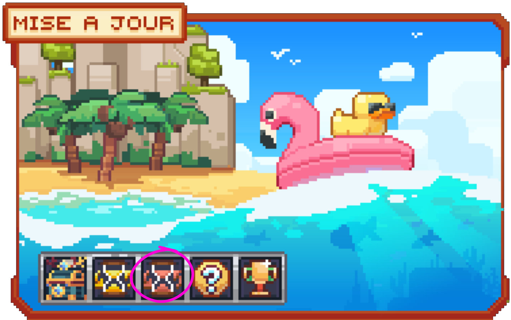
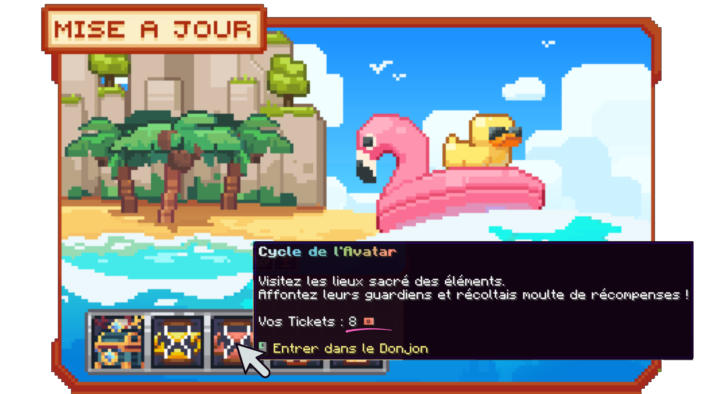
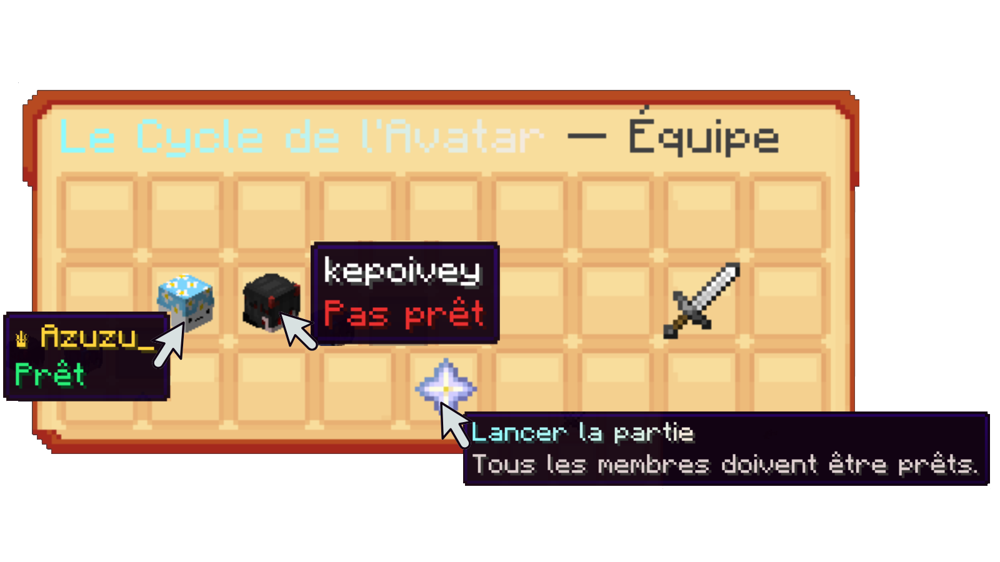
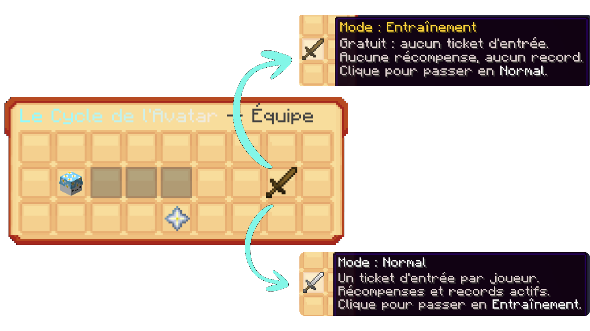

# ☄️ Le Donjon Avatar

Le <mark style="color:orange;">**donjon Avatar**</mark> est le donjon événementiel lié à la <mark style="color:orange;">**maj élémentaire**</mark>. Contrairement aux [<mark style="color:green;">**donjons traditionnels**</mark>](https://wiki.evolucraft.fr/codex/donjons), il se déroule en <mark style="color:orange;">**3 salles successives**</mark>, chacune avec ses propres mobs, mini-boss et boss à vaincre.

## 💠 Comment entrer dans ce <mark style="color:orange;">**donjon Avatar**</mark> ? 🔍

### 🔷 Obtention des tickets 🎫

Chaque jour, vous recevez <mark style="color:orange;">**1 Ticket Donjon Avatar**</mark> _(contrairement à 3 pour le [<mark style="color:green;">**Donjon Infini**</mark>](https://wiki.evolucraft.fr/le-gameplay/donjon-infini))_. Vous pouvez également en obtenir via la [<mark style="color:orange;">**Caisse Élémentaire**</mark>](https://wiki.evolucraft.fr/le-gameplay/les-caisses#caisse-elementaire) _(4 Tickets Donjon Élémental)_.

### 🔷 Ouverture du menu 🏛️

L'accès au donjon Avatar se fait depuis le même menu de <mark style="color:orange;">**mise à jour**</mark> que le Donjon Infini, via un <mark style="color:orange;">**sablier rouge**</mark> _(le Donjon Infini utilise un sablier jaune/or)_.

<figure><figcaption>Aperçu de l'emplacement du <mark style="color:orange;">sablier rouge</mark> dans le menu de mise à jour</figcaption></figure>

En <mark style="color:orange;">**survolant**</mark> le sablier rouge, un aperçu <mark style="color:orange;">**"Cycle de l'Avatar"**</mark> s'affiche, indiquant votre nombre de <mark style="color:orange;">**tickets**</mark>.

<figure><figcaption>Aperçu du <mark style="color:orange;">nombre de tickets</mark> en votre possession au survol</figcaption></figure>

En <mark style="color:orange;">**cliquant**</mark> dessus, vous êtes directement amené au menu de l'équipe, avec les membres de la party, l'épée d'entraînement et la nether star pour lancer la partie.

### 🔷 Jouer à plusieurs 👥

Contrairement au Donjon Infini, le donjon Avatar se joue jusqu'à <mark style="color:orange;">**4 joueurs**</mark> en équipe, depuis le menu <mark style="color:orange;">**"Le Cycle de l'Avatar — Équipe"**</mark> :

* Inviter un joueur : <mark style="color:orange;">**`/atlasbonks party invite <joueur>`**</mark>
* Accepter une invitation : <mark style="color:orange;">**`/atlasbonks party accept <joueur qui l'a invité>`**</mark>
* Se mettre prêt : <mark style="color:orange;">**`/atlasbonks party ready`**</mark>
* Une fois <mark style="color:orange;">**tous les membres prêts**</mark>, l'hôte de la party lance la partie en cliquant sur la <mark style="color:orange;">**nether star**</mark> au centre de l'écran.

<figure><figcaption>Aperçu du menu <mark style="color:orange;">"Le Cycle de l'Avatar — Équipe"</mark></figcaption></figure>


**⚠️ ATTENTION :** Plus vous êtes nombreux dans la party, plus le donjon est <mark style="color:orange;">**difficile**</mark> : les mobs sont plus <mark style="color:orange;">**résistants**</mark> et infligent plus de <mark style="color:orange;">**dégâts**</mark> que si vous êtes seul.


### 🔷 Mode Entraînement ou Normal 🔁

Dans le menu de la party, un clic sur l'épée permet de basculer entre deux modes :

* <mark style="color:orange;">**Mode Entraînement**</mark> : gratuit, ne consomme aucun ticket, mais <mark style="color:orange;">**aucune récompense**</mark>.
* <mark style="color:orange;">**Mode Normal**</mark> : consomme <mark style="color:orange;">**1 ticket par joueur**</mark>, avec récompenses actives.

<figure><figcaption>Aperçu du choix entre <mark style="color:orange;">Mode Entraînement</mark> et <mark style="color:orange;">Mode Normal</mark></figcaption></figure>

## 💠 Comment se déroule ce donjon ? 🕹️

Le donjon Avatar se compose de <mark style="color:orange;">**3 salles**</mark> (mondes), fonctionnant chacune de la même façon :

* Des <mark style="color:orange;">**mobs**</mark> apparaissent en continu dans la salle. Ils <mark style="color:orange;">**gênent**</mark> votre progression mais ne rapportent <mark style="color:orange;">**aucune récompense**</mark> lorsqu'ils sont tués.
* Toutes les <mark style="color:orange;">**2 minutes**</mark>, un <mark style="color:orange;">**mini-boss**</mark> apparaît dans la salle.
* Tuer un <mark style="color:orange;">**mini-boss**</mark> fait apparaître un <mark style="color:orange;">**coffre**</mark>.
* À l'apparition du <mark style="color:orange;">**2ème mini-boss**</mark> de la salle, vous pouvez déclencher le <mark style="color:orange;">**boss**</mark> de la salle : rendez-vous à son autel et trouvez les petites <mark style="color:orange;">**particules bleues**</mark> pour l'invoquer.
* Une fois le <mark style="color:orange;">**boss**</mark> vaincu, un <mark style="color:orange;">**coffre**</mark> apparaît, ainsi qu'un <mark style="color:orange;">**portail**</mark> vers la salle suivante.

Ce fonctionnement est <mark style="color:orange;">**identique sur les 3 salles**</mark>. Cependant, une fois le boss de la <mark style="color:orange;">**3ème et dernière salle**</mark> vaincu, aucun portail n'apparaît : il n'y a plus rien après, il faut alors simplement <mark style="color:orange;">**survivre**</mark>.


**⚠️ ATTENTION :** Plus vous progressez dans le donjon (salle après salle), plus les mobs deviennent <mark style="color:orange;">**résistants**</mark> et <mark style="color:orange;">**puissants**</mark>.


**Voilà, vous connaissez pour l'instant tout ce qu'il y a à savoir sur le donjon <mark style="color:orange;">**Avatar**</mark> ☄️ ! Cette page sera mise à jour dès que plus d'informations seront disponibles.**
