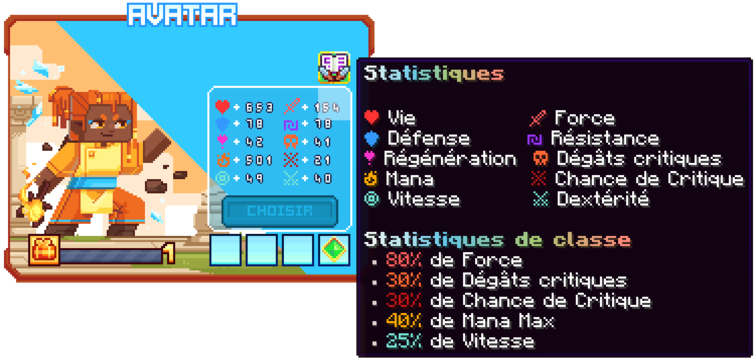

# ☄️ Avatar

Maîtrisez à la fois le feu, la glace et la terre. Changez d'élément à la volée pour adapter votre combo à chaque situation et déchaîner la puissance des trois éléments primordiaux.

<figure><figcaption>
<strong>Aperçu des stats de la classe Avatar</strong>
</figcaption></figure>


Les dégâts des compétences sont en cours de modification, ne les prenez pas pour argent comptant !
-L'équipe du wiki


## 💠 <mark style="color:orange;">Compétences</mark>

### 🔸 <mark style="color:orange;">**Niveau 1 : Attaque de Base • Combo Élémentaire**</mark>

* <mark style="color:white;">**Changement d'éléments**</mark> – Tous éléments : Appuyez sur votre touche de changement de main avec votre arme pour changer d'élément.
* <mark style="color:red;">**Combo Pyro**</mark> – Élément Pyro : Envoie une séquence d'attaques : la première et la seconde sont des fissiles de feu, la troisième une shockwave conique, la quatrième une météorite.
* <mark style="color:blue;">**Combo Cryo**</mark> – Élément Cryo : Envoie des éclats de glace. La troisième envoie une orbe glacée gelant les ennemis, la quatrième une shockwave de neige.
* <mark style="color:green;">**Débris de Terre**</mark> – Élément Terra : Envoie des débris de Terre. La quatrième attaque envoie un gros débris qui repousse.

### 🔸 <mark style="color:orange;">**Niveau 5 : Passif • Maîtrise Élémentaire**</mark>

* <mark style="color:red;">**Chaleur Écarlate**</mark> – Élément Pyro : Chaque attaque de base donne un stack de chaleur. À 3 stacks, la prochaine compétence sera plus puissante.
* <mark style="color:blue;">**Glace Miséricordieuse**</mark> – Élément Cryo : Chaque dégât vous soigne d'un montant fixe. Briser les ennemis glacés crée une zone de soin pour les alliés.
* <mark style="color:green;">**Cercle de la Terre**</mark> – Élément Terra : Un rayon de débris tourne autour de vous et repousse les ennemis approchants. Le rayon s'agrandit quand vous courez.

### 🔸 <mark style="color:orange;">**Niveau 10 : Compétence • Rayon Élémentaire**</mark>

* <mark style="color:red;">**Hellfire Overblast**</mark> – Élément Pyro : Envoie un rayon de feu continu pendant 4 secondes. Brûle les ennemis. _Chaleur Écarlate_ : Dégâts augmentés, ennemis légèrement projetés en arrière.
* <mark style="color:blue;">**Icebound Beam**</mark> – Élément Cryo : Envoie un rayon de glace continu pendant 4 secondes.
* <mark style="color:green;">**Earth Shift**</mark> – Élément Terra : Fait lever 3 piques de terre qui envoient les ennemis dans les airs.

### 🔸 <mark style="color:orange;">**Niveau 15 : Compétence • Assaut Élémentaire**</mark>

* <mark style="color:red;">**Volcanic Spear**</mark> – Élément Pyro : Invoquez une lance de feu qui exécute un combo rapide. Brûle les ennemis. _Chaleur Écarlate_ : Rayon et dégâts augmentés.
* <mark style="color:blue;">**Frostslide Reaver**</mark> – Élément Cryo : Invoquez une lame de glace spectrale vous faisant glisser en avant en tranchant rapidement. Changez de direction au milieu.
* <mark style="color:green;">**Earth Clap**</mark> – Élément Terra : Fait émerger 2 plaques de terre qui envoient les ennemis en l'air puis se referment, étourdissant les ennemis.

### 🔸 <mark style="color:orange;">**Niveau 20 : Compétence • Pluie Élémentaire**</mark>

* <mark style="color:red;">**Firestorm Volley**</mark> – Élément Pyro : Crée des orbes de feu au-dessus de vous qui s'abattent sur les ennemis en brûlant. _Chaleur Écarlate_ : Rayon augmenté, provoque une explosion à l'impact.
* <mark style="color:blue;">**Blizzard Prison**</mark> – Élément Cryo : Invoquez un blizzard faisant tomber du verglas. À la fin, il explose, gelant les ennemis sur place.
* <mark style="color:green;">**Earth Spikes**</mark> – Élément Terra : Fait émerger 3 tiges de terre autour de vous et les fait s'écraser sur les ennemis, infligeant de lourds dégâts et étourdissant.

### 🔸 <mark style="color:orange;">**Niveau 30 : Compétence • Contrôle Élémentaire**</mark>

* <mark style="color:red;">**Magma Dash**</mark> – Élément Pyro : Effectuez un dash en avant laissant une traînée de magma derrière vous. _Chaleur Écarlate_ : Après un délai, le magma explose.
* <mark style="color:blue;">**Crystal Bloomfield**</mark> – Élément Cryo : Fait pousser des fleurs gelées au sol. Quand un ennemi marche dessus, elle explose, gelant les monstres. Une attaque de base fait aussi exploser les fleurs.
* <mark style="color:green;">**Earth Wave**</mark> – Élément Terra : Crée une route de terre se traçant à travers les ennemis, leur faisant des dégâts et les étourdissant.

### 🔸 <mark style="color:orange;">**Niveau 40 : Ultime • Courroux Élémentaire**</mark>

* <mark style="color:red;">**Infernal Judgement**</mark> – Élément Pyro : Vous vous envolez en l'air, invoquez plusieurs lances de feu partant où vous visez. Une dernière lance écarlate vous propulse pour vous écraser sur les ennemis, créant une grosse explosion magmatique.
* <mark style="color:blue;">**Glacial Stampede**</mark> – Élément Cryo : Invoquez une gigantesque bête en rage instoppable, marchant sur les ennemis. Après peu, elle charge, créant une explosion de froid absolu.
* <mark style="color:green;">**Earth Shockwave**</mark> – Élément Terra : Levez des plateformes de terre éjectant les ennemis en l'air. Puis faites écraser les plateformes, étourdissant les ennemis.

## 💠 <mark style="color:orange;">Armes</mark>


Section en cours de complétion : les armes élémentaires ne sont pas encore toutes connues. N'importe quelle classe peut utiliser n'importe quelle arme élémentaire.

